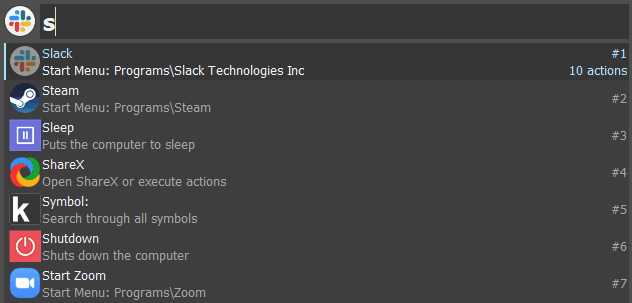

# Keypirinha Plugin: Symbols

This is Symbols, a plugin for the
[Keypirinha](http://keypirinha.com) launcher.

Search for symbols and copy to them to your clipboard.

## Download

https://github.com/josbalcaen/keypirinha-symbols/releases/latest

## Install

#### Managed
[@ueffel](https://github.com/ueffel) wrote [PackageControl](https://github.com/ueffel/Keypirinha-PackageControl), a package manager that eases the install of third-party packages.
It must be installed manually.

#### Manual
Once the `Symbols.keypirinha-package` file is installed,
move it to the `InstalledPackage` folder located at:

* `Keypirinha\portable\Profile\InstalledPackages` in **Portable mode**
* **Or** `%APPDATA%\Keypirinha\InstalledPackages` in **Installed mode** (the
  final path would look like
  `C:\Users\%USERNAME%\AppData\Roaming\Keypirinha\InstalledPackages`)

## Usage

Type "symbol " to search a symbol. This will list all the symbols available. 
Press enter to copy the symbol to your clipboard or press tab to list the copy options.
These include copying the unicode, hex code, html code, css code values.

## Changes

### v1.0

* Initial version of the package

## License

This package is distributed under the terms of the MIT license.

## Credits

Symbols have been parsed from https://www.toptal.com/designers/htmlarrows/

## Contribute

1. Check for open issues or open a fresh issue to start a discussion around a
   feature idea or a bug.
2. Fork this repository on GitHub to start making your changes to the **dev**
   branch.
3. Send a pull request.
4. Add yourself to the *Contributors* section below (or create it if needed)!
